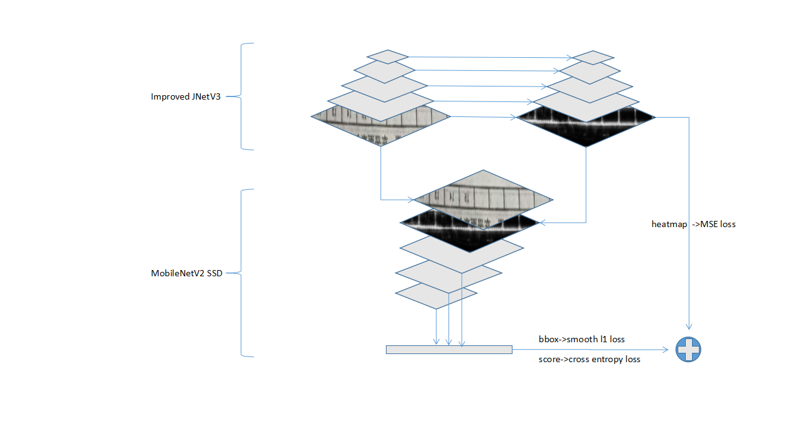
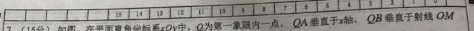
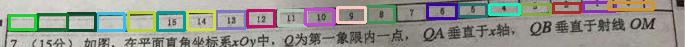
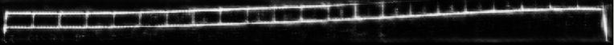

# Improved-JNetV3 SSD in Pytorch

This repo is forked from [pytorch-ssd](https://github.com/qfgaohao/pytorch-ssd). 
- We use MobileNetV2 as basenet
- Change image input size form 300x300 to 768x768, it is propitious to the details of
  table
- We use improved JNetV3 segmentation network, treated as a Auxiliary Supervisory Signal.It can accelerate
 the training process(get same loss : 1 night->20 min) and get a better accuracy
- Change anchor for long width with short height table ceil
 
#### Improved-JNetV3 SSD architecture

#### original MobileNetV2 SSD

#### Improved-JNetV3 SSD

#### Improved-JNetV3 SSD Heatmap

## Dependencies
1. Python 3.6+
2. OpenCV
3. Pytorch 0.4+
4. Caffe2
5. Pandas
6. Boto3 if you want to train models on the Google OpenImages Dataset.

## Train
> train_ssd.py #train file

## Test
> eval_ssd.py #test file